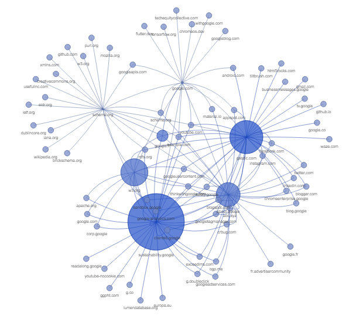

# Python Web Crawler

A very basic web crawler made in Python as a weekend project. It can simply scrapes URLs from a webpage or recursively scrape the URLs that it finds.

## Features

 - Scrape any website once or recursively with a given number of iterations
 - Save scraped URLs and resume scraping later
 - Dump URLs into a text file
 - Dump scraping data into the console
 - Generate graphs to visualize the URLs found and how they are connected

## How to use?
Before using it, the crawler requires a little configuration to work properly. You will have to:

1. Download the required python libraries if they are not already installed on your machine. You can do it by executing the "install_dependencies.bat" batch file, or manually by installing the following libraries:
		- Selenium (for manipulating web drivers)
		- NetworkX (for the generation of network graphs)
		- Matplotlib (used by NetworkX for displaying generated graphs)
		- Scipy (used by NetworkX for generating graphs)
2. If you don't already have it, download the chromedriver.exe file that corresponds to your Chrome or chromium-based browser version here: [https://chromedriver.chromium.org/](https://chromedriver.chromium.org/)
3. Execute the "setup_directories.py" script file to configure the paths of your executables. Simply follow the instructions and the locations of your chromedriver.exe and browser binary will be saved in a "settings.cfg" file in the main directory
4. You can now run the "main.py" script file and follow the instructions to run the web crawler